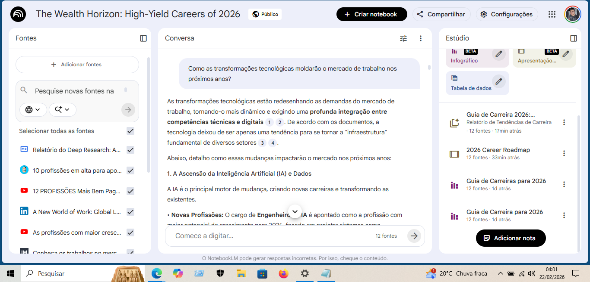
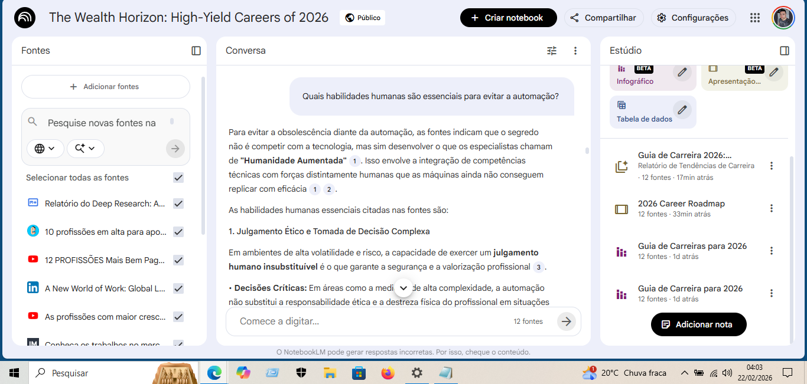

# 🚀 Acelere sua Aprendizagem com IA: Explore o Poder do NotebookLM

## 📌 Sobre o Projeto
Projeto desenvolvido no bootcamp **Bradesco - GenAI & Dados**, promovido pela **DIO**.

O desafio consistiu na criação de um caderno temático no NotebookLM utilizando fontes abertas para desenvolver um mini guia estruturado com apoio de IA Generativa.

---

## 🎯 Objetivo

O modelo foi instruído a atuar como um palestrante de universidade em uma escola. A palestra foi apresentada a um grupo de estudantes que estão prestes a se formar no ensino médio.
O tema da palestra foi:

**"Profissões com o maior potencial financeiro em 2026"**

---

## 🎬 Fontes de vídeo utilizadas: 

- https://www.youtube.com/watch?v=cIcmpezpaCk
- https://www.youtube.com/watch?v=gjzcSl3ZqJw
- https://youtu.be/rODZ-lrYUo0?list=TLGG70BrkbifX2MyMjAyMjAyNg

## 📖 Fontes de texto utilizadas: 

- https://guiadoestudante.abril.com.br/orientacao-profissional/10-profissoes-em-alta-para-apostar-em-2026/
- https://news.linkedin.com/2026/2026-Davos-Press-Release
- https://www.infomoney.com.br/advisor/remuneracao-mercado-financeiro-2026/
- https://exame.com/carreira/contratacoes-em-financas-tendencias-e-perspectivas-para-2026/
- https://www.michaelpage.com.br/estudos-e-tendencias/estudo-de-remuneracao-2023-2024-healthcare-life-sciences-1-HS-069
- https://blog.ipog.edu.br/gestao-e-negocios/profissoes-mais-bem-pagas-em-2026-veja-os-cargos-em-alta-e-como-se-preparar/

---

## 💬 Estratégia de Prompts

Exemplos utilizados:

- "Como as transformações tecnológicas moldarão o mercado de trabalho nos próximos anos?"
- "Crie um infográfico sobre as profissões em alta"
- "Crie uma apresentação motivacional voltado para jovens em fase de decisão profissional."
- "Quais habilidades humanas são essenciais para evitar a automação?"

---

## ✅ Resultado Final

O projeto resultou em:

- Mini guia estruturado
- Resumos organizados
- Infográficos
- Modelo de apresentação
- Conjunto de prompts reutilizáveis
- Aplicação prática de IA como ferramenta de aprendizagem ativa

---

## 📁 Arquivos do Projeto (Pasta assets)

### 📊 Infográficos Gerados

**Infográfico 1 – Guia Para as Carreiras de Maior Sucesso**

**Infográfico 2 – As Profissões e Tendências que Vão Dominar o Mercado**

---

### 💬 Prints dos Prompts Utilizados

**Prompt 1 – Análise das transformações tecnológicas**

**Prompt 2 – Habilidades Humanas Essenciais para Evitar a Automação**

---

### 🎤 Apresentação Final

**Guia de Carreiras Pormissoras - 2026**

📎 [Baixar apresentação completa](assets/Apresentação_2026_Career_Roadmap.pdf)

---

Desenvolvido por Mateus Louis  
Bootcamp Bradesco - GenAI & Dados | DIO
